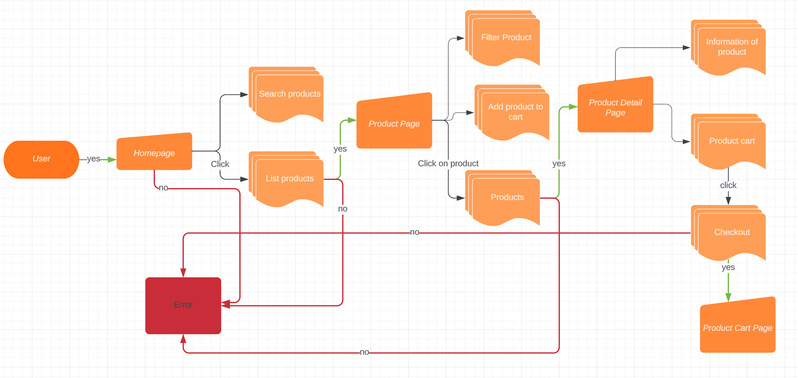

# React last practice

## Overview:

- This document provides information about React basic practice.
- [Design](<https://www.figma.com/file/1PCigj2Eyh06WBUmq2PcSZ/Shopping-(Community)?node-id=0%3A1&mode=dev>)

### Timeline:

- Estimate time: 7 days.

### Technical:

- [HTML5](https://en.wikipedia.org/wiki/HTML5): is a markup language used for structuring and presenting content on the World Wide Web
- [CSS3](https://www.techopedia.com/definition/28243/cascading-style-sheets-level-3-css3): is the iteration of the CSS standard used in the styling and formatting of Web pages
- [TypeScript](https://www.typescriptlang.org/): is a syntactic superset of JavaScript that adds static typing.
- [React](https://react.dev/learn): is a JavaScript library for building user interfaces.
- [React Hook](https://reactjs.org/docs/hooks-intro.html): a new addition in React 16.8. They let you use state and other React features without writing a class.
- [React Router](https://v5.reactrouter.com/web/guides/quick-start): is a standard library for routing in React.
- [Vite](https://vitejs.dev/guide): is a build tool that aims to provide a faster and leaner development experience for modern web projects.
- [Storybook](https://storybook.js.org/): captures the rendered state of a UI component. Developers write multiple stories per component that describe all the “interesting” states a component can support.
- [Jest](https://jestjs.io/docs/getting-started): is a delightful JavaScript Testing Framework with a focus on simplicity.
- Editor: Visual Studio Code.

### Development environment:

- Node: version 18.17.1
- npm: version 9.6.7
- Vite: version 4.4.5
- storybook: version 9.6.7
- testing library: version 14.4.0
- jest: version 29.7.0

### Document:

- [React basic practice requirements and plan](https://docs.google.com/document/d/1UyZAUk6j2ApGb1sOxCEJjaWRgpzEWE3kLKd2yAVh3Qg/edit)

### Flow App

### Workflow

- [Workflow](https://docs.google.com/document/d/1UyZAUk6j2ApGb1sOxCEJjaWRgpzEWE3kLKd2yAVh3Qg/edit#heading=h.s2mc42g0gd9p)

### Task Management

- [Trello](https://trello.com/b/YKtKOCrU/issues-of-practice-1)

## Getting started

All commands are run from the root folder, from a terminal:

| Command                                                                      | Action                      |
| :--------------------------------------------------------------------------- | :-------------------------- |
| `$ git clone https://gitlab.asoft-python.com/kien.nguyen/react-training.git` | Clone Repository with HTTPS |
| `$ git clone git@gitlab.asoft-python.com:kien.nguyen/react-training.git`     | Clone Repository with SSH   |
| `$ cd react-training`                                                        | Redirect to folder          |
| `$ git checkout practice-three`                                              | Checkout branch             |
| `$ npm i`                                                                    | Install packages npm        |
| `$ npm run dev`                                                              | Run webpage                 |
| `$ npm run storybook`                                                        | Run Storybook               |
| `$ npm run test`                                                             | Run Unit Test               |
